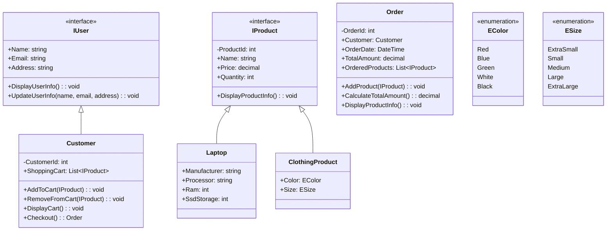

# Online Shopping System

In this project, you will be building an online shopping system that models the basic functionality of an e-commerce platform. The system will consist of several classes that utilize the principles of object-oriented programming, including inheritance, encapsulation, polymorphism, and abstraction.



Here are the classes and interfaces that you need to create with their necessary functionality.

### `IUser.cs`
| Properties | Methods |
|:------------|:-----|
| **Name**: `string` | `void DisplayUserInfo()`  |
| **Email**: `string`      |  `void UpdateUserInfo(string, string, string)` |
| **Address**: `string`      |  |

### `IProduct.cs`
| Properties | Methods |
|:------------|:-----|
| **ProductId**: `int` | `void DisplayProductInfo()`  |
| **Name**: `string`      |   |
| **Price**: `decimal`      |  |
| **Quantity**: `int`      |  |

### `ClothingProduct.cs`
- Implements `IProduct`

| Properties | Methods |
|:------------|:-----|
| **Color**: `EColor` | |
| **Size**: `ESize`      |   |

### `Laptop.cs`
- Implements `IProduct`

| Properties | Methods |
|:------------|:-----|
| **Manufacturer**: `string` | |
| **Processor**: `string`      |   |
| **Ram**: `int`      |   |
| **SsdStorage**: `int`      |   |

### `Customer.cs`
- This class represents a customer in the online shopping system and implements `IUser` interface.
  
| Properties | Methods | Description |
|:------------|:-----|:------------- |
| **CustomerId**: `int` | `void AddToCart(IProduct)`  | This method adds a product to the customer's shopping cart. If the product is already in the cart, it updates the quantity accordingly. |
| **ShoppingCart**: `List<IProduct>` | `void RemoveFromCart(IProduct)`  | This method removes a product from the customer's shopping cart. If the product is not found in the cart, it throws an exception. |
|      | `void DisplayCart()` | This method displays the contents of the customer's shopping cart, including the product name, price, and quantity.  |
|     | `Order       Checkout()` | This method finalizes the customer's order by creating an Order object with the products in the shopping cart. It calculates the total amount of the order, updates the product quantities, and clears the shopping cart. |


### `Order.cs`
- This class represents an order placed by a customer in the online shopping system.
  
| Properties | Methods | Description |
|:------------|:-----|:------------- |
| **OrderId**: `int` | `void AddProduct(IProduct)`  | This method adds a product to the order. If the product is already in the order, it updates the quantity accordingly. |
| **Customer**: `Customer` | `decimal CalculateTotalAmount()` | This method calculates the total amount of the order based on the products and their quantities. |
| **OrderDate**: `DateTime` | `void DisplayOrderInfo()` | This method calculates the total amount of the order based on the products and their quantities. |
| **TotalAmount**: `decimal` | |  |
| **OrderedProducts**: `List<IProduct>` |  |  |

By introducing interfaces with the IUser and IProduct, we create a base structure that can be specialized by implementing them (Customer and different product types) to provide specific implementations.

#### :bulb: Important
**Product**, **Customer** and **Order** IDs should be calculated and assigned in the consttructor internally. They are private fields. There should be a static private field which keeps track of Global ID count sequentially.


## Examples

###### Adding Products to the Shopping Cart and Displaying Cart
```csharp
Customer customer = new Customer(1, "John Doe", "john@example.com", "123 Main St");

IProduct laptop = new Laptop(1, "Dell Laptop", 999.99m, 10, "Dell", "Intel Core i7", 16, 512);
IProduct tShirt = new ClothingProduct(2, "T-Shirt", 19.99m, 5, EColor.Blue, ESize.Large);

customer.AddToCart(laptop);
customer.AddToCart(tShirt);

customer.DisplayCart();
```
###### Output
```bash
Shopping Cart:
-------------------------------------------------------------
    Name                Price       Quantity        Available
    Dell Laptop         $999.99     1               10
    T-Shirt             $19.99      1               5
-------------------------------------------------------------

```

###### Removing a Product from the Shopping Cart
```csharp
Customer customer = new Customer("John Doe", "john@example.com", "123 Main St");

IProduct laptop = new Laptop("Dell Laptop", 999.99m, 10, "Dell", "Intel Core i7", 16, 512);
IProduct tShirt = new ClothingProduct(2, "T-Shirt", 19.99m, 5, EColor.Blue, ESize.Large);

customer.AddToCart(laptop);
customer.AddToCart(tShirt);

customer.RemoveFromCart(laptop);

customer.DisplayCart();
```
###### Output
```bash
-------------------------------------------------------------
Shopping Cart:
    Name                Price       Quantity        Available
    T-Shirt             $19.99      1               5
-------------------------------------------------------------
```

###### Displaying Product Information
```csharp
IProduct laptop = new Laptop(
    "Dell Laptop", 
    999.99m, 
    10, 
    "Dell", 
    "Intel Core i7", 16, 512);

laptop.DisplayProductInfo();
```
###### Output
```bash
--------------------------------------------------------------------------------------
Product Information:
    Name                Price       Manufacturer        Processor       RAM     SSD
    Dell Laptop         $999.99     Dell                Intel Core i7   16GB    256GB
--------------------------------------------------------------------------------------
```


###### Creating an Order and Calculating the Total Amount
```csharp
Customer customer = new Customer("John Doe", "john@example.com", "123 Main St");

IProduct laptop = new Laptop("Dell Laptop", 999.99m, 10, "Dell", "Intel Core i7", 16, 512);
IProduct tShirt = new ClothingProduct("T-Shirt", 19.99m, 5, EColor.Blue, ESize.Large);

customer.AddToCart(laptop);
customer.AddToCart(laptop);
customer.AddToCart(tShirt);

Order order = customer.Checkout();

order.DisplayOrderInfo();
```
###### Output
```bash
-----------------------------------------------------
Order Information:
    ID      Customer        Date        Total Amount
    1       John Doe        2023/05/30  $2019.97

Order Products
    Name            Price       Quantity
    Dell Latop      $999.99     2
    T-Shirt         $19.99      1
-----------------------------------------------------
```

###### Updating User Information
```csharp
Customer customer = new Customer("John Doe", "john@example.com", "123 Main St");

customer.UpdateUserInfo("Jane Smith", "jane@example.com", "456 Elm St");

customer.DisplayUserInfo();
```
###### Output
```bash
-------------------------------------------------------
Customer Information:
    Name            Email                   Address
    Jane Smith      jane@example.com        456 Elm St
-------------------------------------------------------
```